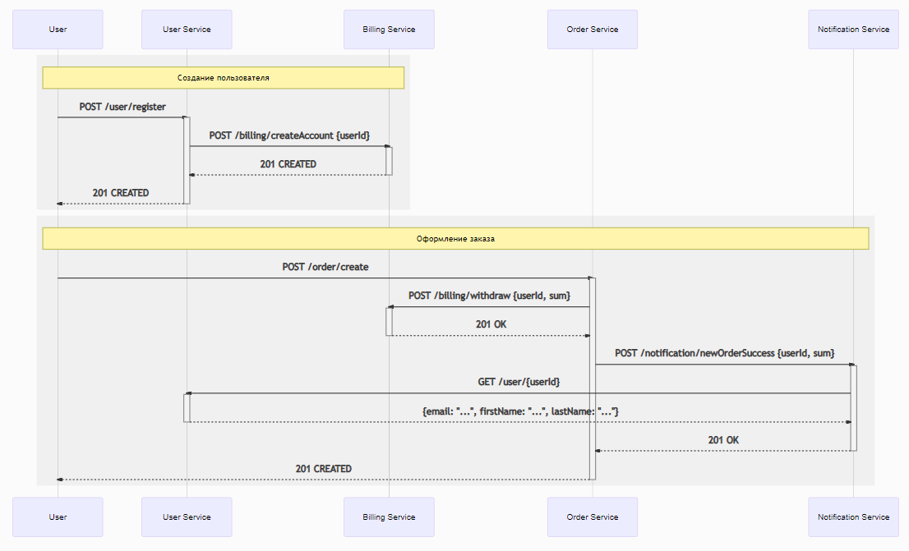

# Выбор способа взаимодействия сервисов

## Синхронное http взаимодействие через rest

[Исходники диаграммы](https://mermaid-js.github.io/mermaid-live-editor/#/edit/eyJjb2RlIjoic2VxdWVuY2VEaWFncmFtXG5cbnBhcnRpY2lwYW50IFVzZXJcbnBhcnRpY2lwYW50IFVzZXIgU2VydmljZVxucGFydGljaXBhbnQgQmlsbGluZyBTZXJ2aWNlXG5wYXJ0aWNpcGFudCBPcmRlciBTZXJ2aWNlXG5wYXJ0aWNpcGFudCBOb3RpZmljYXRpb24gU2VydmljZVxuXG5yZWN0IHJnYigyNDAsIDI0MCwgMjQwKVx0XG5Ob3RlIG92ZXIgVXNlciwgQmlsbGluZyBTZXJ2aWNlOiDQodC-0LfQtNCw0L3QuNC1INC_0L7Qu9GM0LfQvtCy0LDRgtC10LvRj1xuVXNlci0-PlVzZXIgU2VydmljZTogUE9TVCAvdXNlci9yZWdpc3RlclxuYWN0aXZhdGUgVXNlciBTZXJ2aWNlXG5Vc2VyIFNlcnZpY2UtPj5CaWxsaW5nIFNlcnZpY2U6IFBPU1QgL2JpbGxpbmcvY3JlYXRlQWNjb3VudCB7dXNlcklkfVxuYWN0aXZhdGUgQmlsbGluZyBTZXJ2aWNlXG5CaWxsaW5nIFNlcnZpY2UtLT4-VXNlciBTZXJ2aWNlOiAyMDEgQ1JFQVRFRFxuZGVhY3RpdmF0ZSBCaWxsaW5nIFNlcnZpY2VcblVzZXIgU2VydmljZS0tPj5Vc2VyOiAyMDEgQ1JFQVRFRFxuZGVhY3RpdmF0ZSBVc2VyIFNlcnZpY2VcbmVuZFxuXG5yZWN0IHJnYigyNDAsIDI0MCwgMjQwKVx0XG5Ob3RlIG92ZXIgVXNlciwgTm90aWZpY2F0aW9uIFNlcnZpY2U6INCe0YTQvtGA0LzQu9C10L3QuNC1INC30LDQutCw0LfQsFxuVXNlci0-Pk9yZGVyIFNlcnZpY2U6IFBPU1QgL29yZGVyL2NyZWF0ZVxuYWN0aXZhdGUgT3JkZXIgU2VydmljZVxuXG5PcmRlciBTZXJ2aWNlLT4-QmlsbGluZyBTZXJ2aWNlOiBQT1NUIC9iaWxsaW5nL3dpdGhkcmF3IHt1c2VySWQsIHN1bX1cbmFjdGl2YXRlIEJpbGxpbmcgU2VydmljZVxuQmlsbGluZyBTZXJ2aWNlLS0-Pk9yZGVyIFNlcnZpY2U6IDIwMSBPS1xuZGVhY3RpdmF0ZSBCaWxsaW5nIFNlcnZpY2VcblxuXG5PcmRlciBTZXJ2aWNlLT4-Tm90aWZpY2F0aW9uIFNlcnZpY2U6IFBPU1QgL25vdGlmaWNhdGlvbi9uZXdPcmRlclN1Y2Nlc3Mge3VzZXJJZCwgc3VtfVxuYWN0aXZhdGUgTm90aWZpY2F0aW9uIFNlcnZpY2Vcbk5vdGlmaWNhdGlvbiBTZXJ2aWNlLT4-VXNlciBTZXJ2aWNlOiBHRVQgL3VzZXIve3VzZXJJZH1cbmFjdGl2YXRlIFVzZXIgU2VydmljZVxuVXNlciBTZXJ2aWNlLS0-Pk5vdGlmaWNhdGlvbiBTZXJ2aWNlOiB7ZW1haWw6IFwiLi4uXCIsIGZpcnN0TmFtZTogXCIuLi5cIiwgbGFzdE5hbWU6IFwiLi4uXCJ9XG5kZWFjdGl2YXRlIFVzZXIgU2VydmljZVxuTm90aWZpY2F0aW9uIFNlcnZpY2UtLT4-T3JkZXIgU2VydmljZTogMjAxIE9LXG5kZWFjdGl2YXRlIE5vdGlmaWNhdGlvbiBTZXJ2aWNlXG5cbk9yZGVyIFNlcnZpY2UtLT4-VXNlcjogMjAxIENSRUFURURcbmRlYWN0aXZhdGUgT3JkZXIgU2VydmljZVxuZW5kXG5cbiIsIm1lcm1haWQiOnsidGhlbWUiOiJkZWZhdWx0IiwidGhlbWVWYXJpYWJsZXMiOnsiYmFja2dyb3VuZCI6IndoaXRlIiwicHJpbWFyeUNvbG9yIjoiI0VDRUNGRiIsInNlY29uZGFyeUNvbG9yIjoiI2ZmZmZkZSIsInRlcnRpYXJ5Q29sb3IiOiJoc2woODAsIDEwMCUsIDk2LjI3NDUwOTgwMzklKSIsInByaW1hcnlCb3JkZXJDb2xvciI6ImhzbCgyNDAsIDYwJSwgODYuMjc0NTA5ODAzOSUpIiwic2Vjb25kYXJ5Qm9yZGVyQ29sb3IiOiJoc2woNjAsIDYwJSwgODMuNTI5NDExNzY0NyUpIiwidGVydGlhcnlCb3JkZXJDb2xvciI6ImhzbCg4MCwgNjAlLCA4Ni4yNzQ1MDk4MDM5JSkiLCJwcmltYXJ5VGV4dENvbG9yIjoiIzEzMTMwMCIsInNlY29uZGFyeVRleHRDb2xvciI6IiMwMDAwMjEiLCJ0ZXJ0aWFyeVRleHRDb2xvciI6InJnYig5LjUwMDAwMDAwMDEsIDkuNTAwMDAwMDAwMSwgOS41MDAwMDAwMDAxKSIsImxpbmVDb2xvciI6IiMzMzMzMzMiLCJ0ZXh0Q29sb3IiOiIjMzMzIiwibWFpbkJrZyI6IiNFQ0VDRkYiLCJzZWNvbmRCa2ciOiIjZmZmZmRlIiwiYm9yZGVyMSI6IiM5MzcwREIiLCJib3JkZXIyIjoiI2FhYWEzMyIsImFycm93aGVhZENvbG9yIjoiIzMzMzMzMyIsImZvbnRGYW1pbHkiOiJcInRyZWJ1Y2hldCBtc1wiLCB2ZXJkYW5hLCBhcmlhbCIsImZvbnRTaXplIjoiMTZweCIsImxhYmVsQmFja2dyb3VuZCI6IiNlOGU4ZTgiLCJub2RlQmtnIjoiI0VDRUNGRiIsIm5vZGVCb3JkZXIiOiIjOTM3MERCIiwiY2x1c3RlckJrZyI6IiNmZmZmZGUiLCJjbHVzdGVyQm9yZGVyIjoiI2FhYWEzMyIsImRlZmF1bHRMaW5rQ29sb3IiOiIjMzMzMzMzIiwidGl0bGVDb2xvciI6IiMzMzMiLCJlZGdlTGFiZWxCYWNrZ3JvdW5kIjoiI2U4ZThlOCIsImFjdG9yQm9yZGVyIjoiaHNsKDI1OS42MjYxNjgyMjQzLCA1OS43NzY1MzYzMTI4JSwgODcuOTAxOTYwNzg0MyUpIiwiYWN0b3JCa2ciOiIjRUNFQ0ZGIiwiYWN0b3JUZXh0Q29sb3IiOiJibGFjayIsImFjdG9yTGluZUNvbG9yIjoiZ3JleSIsInNpZ25hbENvbG9yIjoiIzMzMyIsInNpZ25hbFRleHRDb2xvciI6IiMzMzMiLCJsYWJlbEJveEJrZ0NvbG9yIjoiI0VDRUNGRiIsImxhYmVsQm94Qm9yZGVyQ29sb3IiOiJoc2woMjU5LjYyNjE2ODIyNDMsIDU5Ljc3NjUzNjMxMjglLCA4Ny45MDE5NjA3ODQzJSkiLCJsYWJlbFRleHRDb2xvciI6ImJsYWNrIiwibG9vcFRleHRDb2xvciI6ImJsYWNrIiwibm90ZUJvcmRlckNvbG9yIjoiI2FhYWEzMyIsIm5vdGVCa2dDb2xvciI6IiNmZmY1YWQiLCJub3RlVGV4dENvbG9yIjoiYmxhY2siLCJhY3RpdmF0aW9uQm9yZGVyQ29sb3IiOiIjNjY2IiwiYWN0aXZhdGlvbkJrZ0NvbG9yIjoiI2Y0ZjRmNCIsInNlcXVlbmNlTnVtYmVyQ29sb3IiOiJ3aGl0ZSIsInNlY3Rpb25Ca2dDb2xvciI6InJnYmEoMTAyLCAxMDIsIDI1NSwgMC40OSkiLCJhbHRTZWN0aW9uQmtnQ29sb3IiOiJ3aGl0ZSIsInNlY3Rpb25Ca2dDb2xvcjIiOiIjZmZmNDAwIiwidGFza0JvcmRlckNvbG9yIjoiIzUzNGZiYyIsInRhc2tCa2dDb2xvciI6IiM4YTkwZGQiLCJ0YXNrVGV4dExpZ2h0Q29sb3IiOiJ3aGl0ZSIsInRhc2tUZXh0Q29sb3IiOiJ3aGl0ZSIsInRhc2tUZXh0RGFya0NvbG9yIjoiYmxhY2siLCJ0YXNrVGV4dE91dHNpZGVDb2xvciI6ImJsYWNrIiwidGFza1RleHRDbGlja2FibGVDb2xvciI6IiMwMDMxNjMiLCJhY3RpdmVUYXNrQm9yZGVyQ29sb3IiOiIjNTM0ZmJjIiwiYWN0aXZlVGFza0JrZ0NvbG9yIjoiI2JmYzdmZiIsImdyaWRDb2xvciI6ImxpZ2h0Z3JleSIsImRvbmVUYXNrQmtnQ29sb3IiOiJsaWdodGdyZXkiLCJkb25lVGFza0JvcmRlckNvbG9yIjoiZ3JleSIsImNyaXRCb3JkZXJDb2xvciI6IiNmZjg4ODgiLCJjcml0QmtnQ29sb3IiOiJyZWQiLCJ0b2RheUxpbmVDb2xvciI6InJlZCIsImxhYmVsQ29sb3IiOiJibGFjayIsImVycm9yQmtnQ29sb3IiOiIjNTUyMjIyIiwiZXJyb3JUZXh0Q29sb3IiOiIjNTUyMjIyIiwiY2xhc3NUZXh0IjoiIzEzMTMwMCIsImZpbGxUeXBlMCI6IiNFQ0VDRkYiLCJmaWxsVHlwZTEiOiIjZmZmZmRlIiwiZmlsbFR5cGUyIjoiaHNsKDMwNCwgMTAwJSwgOTYuMjc0NTA5ODAzOSUpIiwiZmlsbFR5cGUzIjoiaHNsKDEyNCwgMTAwJSwgOTMuNTI5NDExNzY0NyUpIiwiZmlsbFR5cGU0IjoiaHNsKDE3NiwgMTAwJSwgOTYuMjc0NTA5ODAzOSUpIiwiZmlsbFR5cGU1IjoiaHNsKC00LCAxMDAlLCA5My41Mjk0MTE3NjQ3JSkiLCJmaWxsVHlwZTYiOiJoc2woOCwgMTAwJSwgOTYuMjc0NTA5ODAzOSUpIiwiZmlsbFR5cGU3IjoiaHNsKDE4OCwgMTAwJSwgOTMuNTI5NDExNzY0NyUpIn19LCJ1cGRhdGVFZGl0b3IiOmZhbHNlfQ)

[Файл с описанием rest интерфейсов](docs/rest/openapi.yaml)

[Эти самые интерфейсы в Swagger](https://petstore.swagger.io/?url=)

